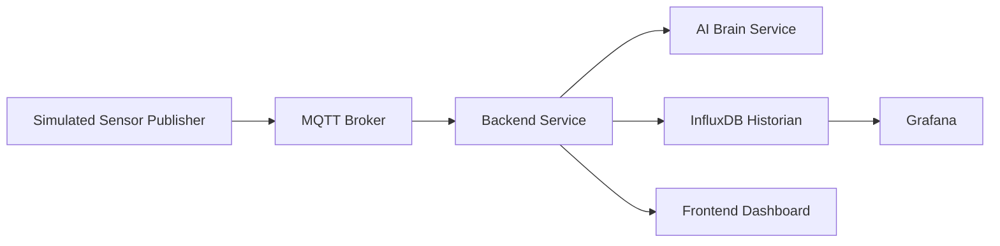
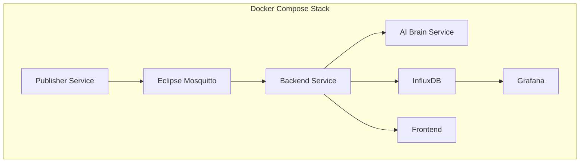
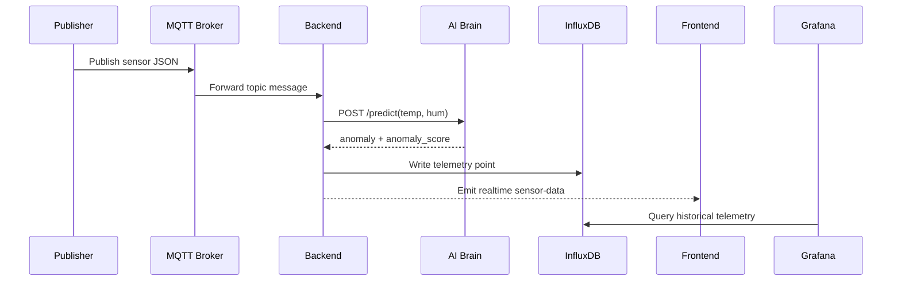
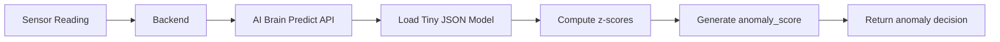

# System Architecture Document

## 1. Purpose

This document describes the current architecture of the CO326 Industrial Digital Twin project and maps the implementation to the course requirement structure. The project simulates an industrial monitoring pipeline from edge sensing to historian storage and visualization.

## 2. System Summary

The system currently includes:

- Simulated sensor data generation
- MQTT-based telemetry transport
- Lightweight anomaly detection service designed to approximate ESP32-friendly runtime constraints
- Backend processing and real-time event forwarding
- InfluxDB historian
- Grafana visualization layer
- React-based dashboard frontend

## 3. High-Level Architecture

## 4. Docker Deployment View

## 5. Data Flow Diagram

## 6. Four-Layer IIoT Mapping

### Layer 1: Perception Layer

Current implementation:

- Simulated temperature and humidity generation in the publisher service
- Lightweight anomaly inference logic represented by the AI Brain service

Target industrial interpretation:

- Replace simulated source with real ESP32-S3 sensor acquisition
- Run anomaly detection on-device

### Layer 2: Transport Layer

Current implementation:

- MQTT broker for telemetry transport

Current topic:

- `iot/sensor`

Future improvement:

- Replace with Sparkplug B / Unified Namespace topic structure

### Layer 3: Edge-Logic Layer

Current implementation:

- Backend service performs message ingestion, anomaly orchestration, historian writes, and real-time forwarding

Future improvement:

- Introduce Node-RED for flow logic, rules, and orchestration

### Layer 4: Application Layer

Current implementation:

- InfluxDB for time-series storage
- Grafana for historian visualization
- Frontend dashboard for real-time display

## 7. Service Responsibilities

### 7.1 Publisher

Responsibilities:

- Generate simulated sensor values
- Publish data periodically to MQTT

Inputs:

- Internal simulation logic

Outputs:

- Sensor JSON payload on MQTT

### 7.2 MQTT Broker

Responsibilities:

- Transport telemetry between publisher and backend

### 7.3 AI Brain

Responsibilities:

- Provide lightweight statistical anomaly detection
- Simulate an ESP32-friendly inference runtime

Current model behavior:

- Uses small JSON configuration
- Computes z-score based anomaly scoring
- Runs under constrained container resources

### 7.4 Backend

Responsibilities:

- Subscribe to MQTT messages
- Request anomaly decisions from AI Brain
- Store telemetry in InfluxDB
- Forward real-time updates to the dashboard

### 7.5 InfluxDB

Responsibilities:

- Store time-series telemetry
- Retain anomaly-related fields for analysis

Stored fields:

- `temperature`
- `humidity`
- `anomaly`
- `anomaly_score`

### 7.6 Grafana

Responsibilities:

- Query InfluxDB
- Provide historian-based dashboards

### 7.7 Frontend

Responsibilities:

- Show live readings
- Display anomalies and live trends

## 8. Current ML Runtime Architecture

## 9. Current Strengths

- End-to-end simulated telemetry pipeline is working
- Historian support is included
- Grafana datasource provisioning exists
- AI runtime is lightweight and more aligned with ESP32-style constraints than a heavy ML container

## 10. Current Gaps Against Assignment

- Real ESP32-S3 firmware is not yet implemented
- Sparkplug B / UNS topic hierarchy is not yet implemented
- Node-RED is not yet integrated
- Modbus TCP is not yet integrated
- Digital twin bidirectional control is not yet implemented
- RUL estimation is not yet implemented
- Security features such as MQTT auth, ACLs, and LWT are not yet complete

## 11. Recommended Next Improvements

1. Replace the simulated edge path with actual ESP32-S3 firmware.
2. Introduce Sparkplug B topic structure and Unified Namespace naming.
3. Add Node-RED for orchestration and RUL logic.
4. Add actuator control path for bidirectional digital twin behavior.
5. Build Grafana dashboards for historian trends and alarms.
