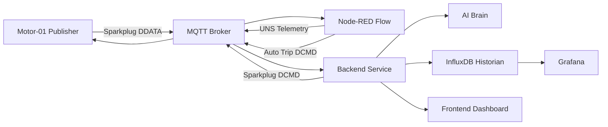
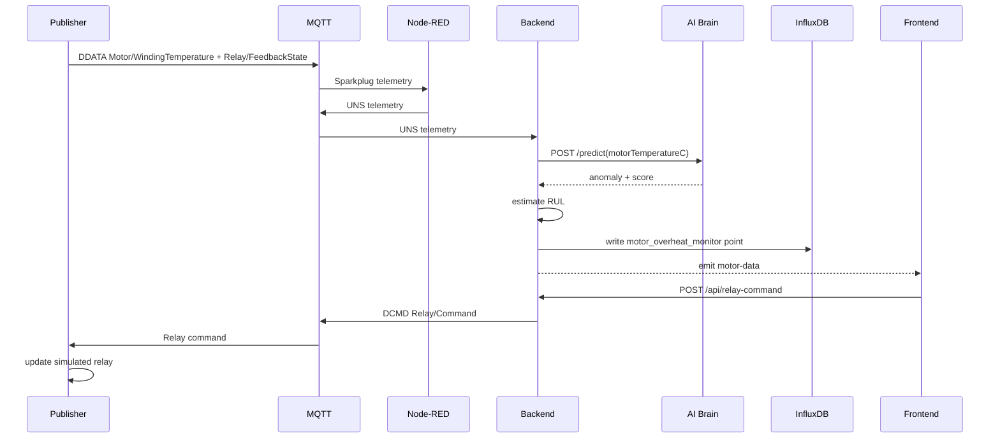

# System Architecture Document

## 1. Purpose

This document describes the current CO326 Industrial Digital Twin implementation. The project is now centered on one industrial use case: Motor-01 overheating monitoring with relay trip simulation.

## 2. Use Case Scope

- Sensor: `Motor/WindingTemperature`
- Actuator: protective relay trip/reset feedback
- Dashboard control path: frontend command -> backend API -> Sparkplug B `DCMD` -> publisher relay simulation
- Physical feedback path: publisher relay state -> Sparkplug B `DDATA` -> Node-RED -> UNS telemetry -> backend -> frontend
- Predictive feature: backend RUL estimation from the temperature trend and relay state

## 3. High-Level Architecture

## 4. MQTT Namespace

- Sparkplug telemetry: `spBv1.0/CO326/DDATA/Plant1.Line1.MotorCell/Motor01`
- Sparkplug relay command: `spBv1.0/CO326/DCMD/Plant1.Line1.MotorCell/Motor01`
- Sparkplug birth: `spBv1.0/CO326/DBIRTH/Plant1.Line1.MotorCell/Motor01`
- UNS telemetry: `uns/CO326/Plant1/Line1/MotorCell/Motor01/telemetry`

The payload uses Sparkplug-style metric names in JSON so the simulated services, Node-RED, and React dashboard can inspect the values without a protobuf dependency.

## 5. Data Flow

## 6. Four-Layer IIoT Mapping

### Layer 1: Perception Layer

- Simulated Motor-01 winding temperature sensor
- Simulated protective relay actuator with physical feedback
- Tiny AI Brain model that scores motor temperature anomalies

### Layer 2: Transport Layer

- MQTT broker
- Sparkplug B topic namespace for device telemetry and commands
- Unified Namespace topic for normalized application telemetry

### Layer 3: Edge Logic Layer

- Node-RED flow bridges Sparkplug `DDATA` to UNS telemetry
- Node-RED over-temperature interlock publishes a Sparkplug `DCMD` trip command
- Backend adds command API, RUL estimation, and historian writes

### Layer 4: Application Layer

- React dashboard displays temperature, relay feedback, RUL, and protection events
- Dashboard sends relay `AUTO`, `TRIP`, and `RESET` commands
- InfluxDB stores motor telemetry and RUL fields
- Grafana queries the historian

## 7. Historian Fields

Measurement: `motor_overheat_monitor`

- `motor_temperature_c`
- `anomaly`
- `anomaly_score`
- `rul_hours`
- `remaining_life_percent`
- `thermal_stress_index`
- `accumulated_damage_hours`
- `over_temperature`
- `relay_command`
- `relay_feedback`
- `motor_state`
- `trip_reason`
